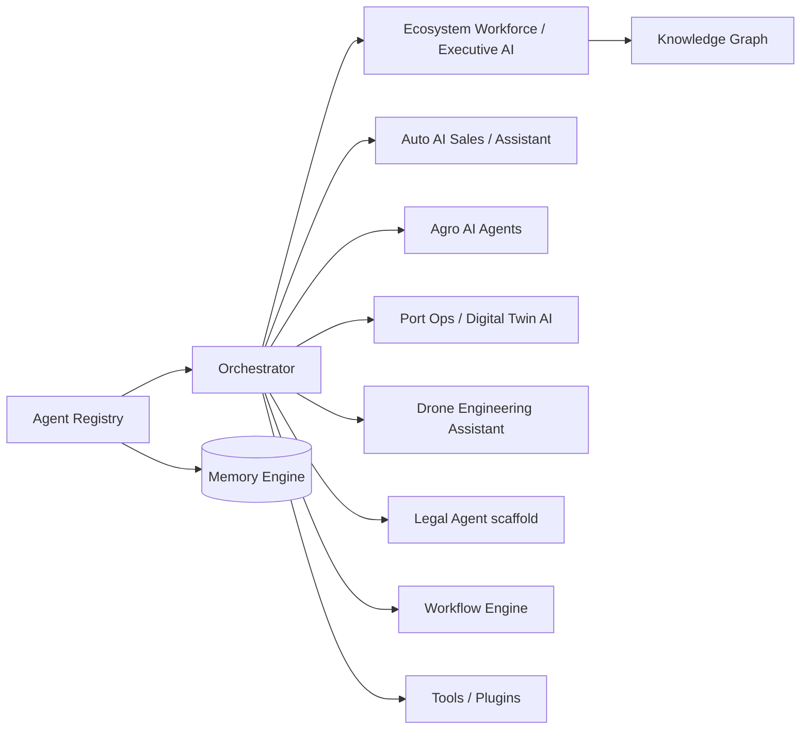

# Agent Graph

---
[[INDEX]] · [[ARCHITECTURE]] · [[diagrams/PLATFORM_GRAPH]] · [[diagrams/AGENT_GRAPH]] · [[diagrams/APPLICATION_GRAPH]] · [[diagrams/DATA_FLOW]]

## Overview
How agents are registered, orchestrated, and specialized per layer/application.

## Architecture

## Components
- Core registry + orchestrator — [[AI_AGENTS]]
- Cognitive engines feeding decisions
- App assistants with domain policies (e.g. drone engineering-only)

## Relationships
Agents consume [[MEMORY_ENGINE]], [[WORKFLOW_ENGINE]], [[PLUGIN_SDK]], and optionally [[KNOWLEDGE_GRAPH]].

## APIs
Assist endpoints under Ecosystem and app prefixes — [[API_REFERENCE]].

## Future roadmap
Shared skill catalog and cross-app handoff protocols ([[ROADMAP]]).
