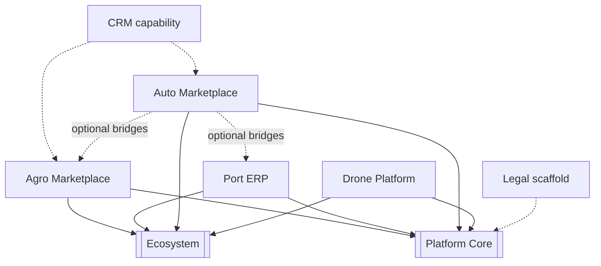

# Application Graph

---
[[INDEX]] · [[ARCHITECTURE]] · [[diagrams/PLATFORM_GRAPH]] · [[diagrams/AGENT_GRAPH]] · [[diagrams/APPLICATION_GRAPH]] · [[diagrams/DATA_FLOW]]

## Overview
Vertical applications and cross-cutting CRM/Legal capabilities relative to Core and Ecosystem.

## Architecture

## Components
Pages: [[applications/AGRO_MARKETPLACE]], [[applications/PORT_ERP]], [[applications/AUTO_MARKETPLACE]], [[applications/DRONE_PLATFORM]], [[applications/CRM]], [[applications/LEGAL_PLATFORM]].

## Relationships
Optional Auto→Agro/Port bridges are outbound only. Drone is isolated besides Core/Ecosystem bridges.

## APIs
Per-app prefixes in [[API_REFERENCE]].

## Future roadmap
Promote Legal to full application node; register all apps in Ecosystem manifest ([[ROADMAP]]).
