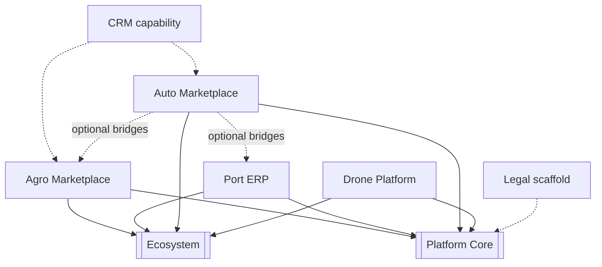

# Application Graph

---
[[INDEX]] · [[ARCHITECTURE]] · [[diagrams/PLATFORM_GRAPH]] · [[diagrams/AGENT_GRAPH]] · [[diagrams/APPLICATION_GRAPH]] · [[diagrams/DATA_FLOW]]

## Overview
Vertical applications and cross-cutting CRM/Legal capabilities relative to Core and Ecosystem.

## Architecture

## Components
Pages: [[applications/AGRO_MARKETPLACE]], [[applications/PORT_ERP]], [[applications/AUTO_MARKETPLACE]], [[applications/DRONE_PLATFORM]], [[applications/CRM]], [[applications/LEGAL_PLATFORM]].

## Relationships
Optional Auto→Agro/Port bridges are outbound only. Drone is isolated besides Core/Ecosystem bridges.

## APIs
Per-app prefixes in [[API_REFERENCE]].

## Future roadmap
Promote Legal to full application node; register all apps in Ecosystem manifest ([[ROADMAP]]).

## Responsibilities
Document and navigate this concern within the Obsidian living vault (Knowledge 1.1).

## Interfaces
Wiki links, dashboards, and registries. Runtime interfaces described where applicable.

## REST APIs
See [[registries/API_REGISTRY]] and [[API_REFERENCE]] when this page owns HTTP surfaces; otherwise N/A.

## Events
Domain or documentation events as applicable; see related sprint pages.

## References
Repository `docs/`, manifests, [[standards/DOCUMENTATION_STANDARDS]].

## Related pages
[[INDEX]] · [[DASHBOARD]] · [[ROADMAP]] · [[registries/COMPONENT_REGISTRY]]
