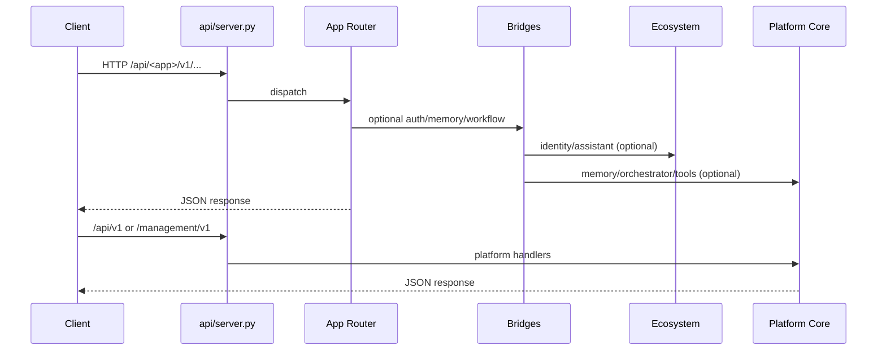

# Data Flow

---
[[INDEX]] · [[ARCHITECTURE]] · [[diagrams/PLATFORM_GRAPH]] · [[diagrams/AGENT_GRAPH]] · [[diagrams/APPLICATION_GRAPH]] · [[diagrams/DATA_FLOW]]

## Overview
Request and data movement from clients through the API gateway into Platform, Ecosystem, and applications.

## Architecture

## Components
- Gateway assembly in `api/server.py`
- App `api/register.py` modules
- Bridge stubs when Core/Ecosystem unavailable
- Observability via `/metrics` and health probes — [[DEPLOYMENT]]

## Relationships
Aligns with [[ARCHITECTURE]] layering and [[SECURITY]] auth middleware patterns.

## APIs
Full prefix table: [[API_REFERENCE]].

## Future roadmap
Async event-bus fan-out from Ecosystem communication layer into all apps ([[ROADMAP]]).
