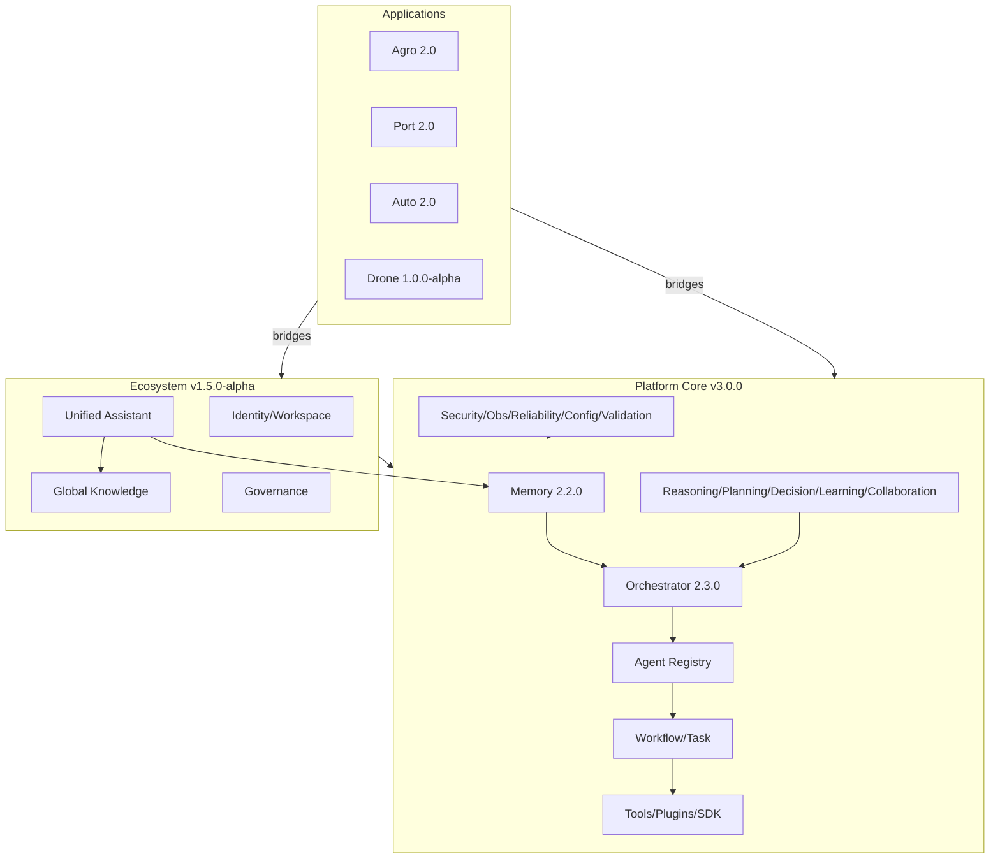

# Platform Graph

---
[[INDEX]] · [[ARCHITECTURE]] · [[diagrams/PLATFORM_GRAPH]] · [[diagrams/AGENT_GRAPH]] · [[diagrams/APPLICATION_GRAPH]] · [[diagrams/DATA_FLOW]]

## Overview
Structural graph of Platform Core engines and their adjacency to Ecosystem and applications.

## Architecture

## Components
Nodes map to pages: [[PLATFORM_CORE]], [[MEMORY_ENGINE]], [[AI_AGENTS]], [[WORKFLOW_ENGINE]], [[PLUGIN_SDK]], [[KNOWLEDGE_GRAPH]], [[SECURITY]].

## Relationships
Strict dependency direction: Apps → bridges → Ecosystem/Core. Core does not import apps.

## APIs
HTTP edges summarized in [[diagrams/DATA_FLOW]] and [[API_REFERENCE]].

## Future roadmap
Add Legal app node when productized ([[applications/LEGAL_PLATFORM]]).
