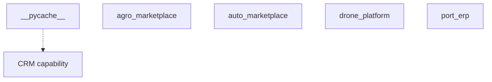

# Application Graph Automated

## Overview
Auto-regenerated Mermaid diagram (Application Graph Automated) by Documentation Assistant.

## Architecture

## Components
- Generated from current module/API/agent scan

## Relationships
[[ARCHITECTURE_DASHBOARD]] · [[diagrams/PLATFORM_GRAPH]] · [[build_graph]]

## Responsibilities
Keep graphs synchronized with repository structure.

## Interfaces
`python3 knowledge/tools/build_graph.py`

## REST APIs
API graph reflects discovered prefixes only

## Events
mermaid_regenerated

## Future roadmap
[[ROADMAP]]

## References
[[automation/DOCUMENTATION_ASSISTANT]]

## Related pages
[[INDEX]] · [[DASHBOARD]]
