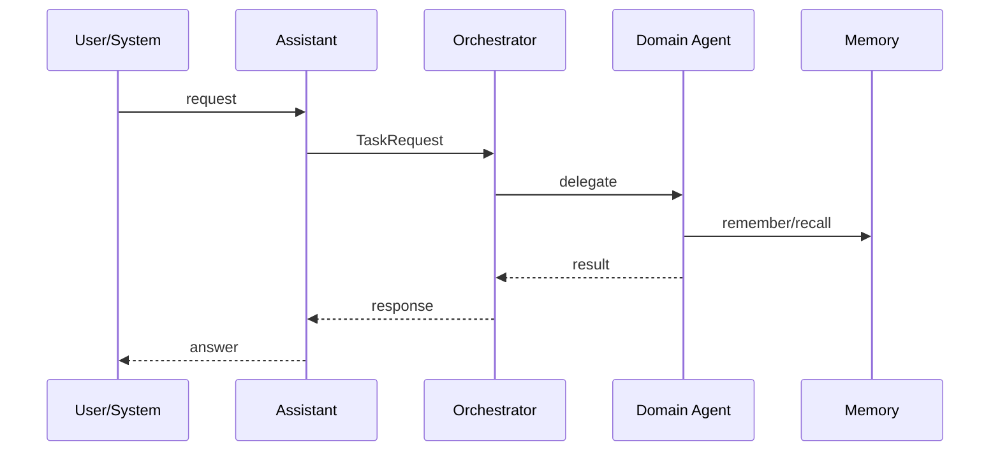

# Agent Communication

## Overview
Agent Communication Mermaid diagram for Knowledge 1.1.

## Architecture

## Components
- Related: [[diagrams/DATA_FLOW]] · [[AI Agents]]

## Relationships
[[ARCHITECTURE_DASHBOARD]] · [[ARCHITECTURE]] · [[INDEX]] · [[Platform Core]] · [[AI Agents]]

## Responsibilities
Visualize structure for Obsidian and engineering onboarding.

## Interfaces
Mermaid diagram rendered in Obsidian.

## REST APIs
See [[registries/API_REGISTRY]] when applicable.

## Events
N/A (documentation diagram).

## Future roadmap
Keep diagrams aligned after each sprint via [[automation/DOCUMENTATION_AUTOMATION]].

## References
`docs/architecture.md` and app docs.

## Related pages
[[DASHBOARD]] · [[diagrams/PLATFORM_GRAPH]] · [[diagrams/APPLICATION_GRAPH]]
