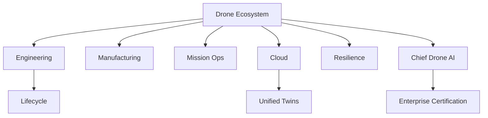

# Architecture Graph

```mermaid
flowchart TB
  ECO[Drone Ecosystem] --> ENG[Engineering]
  ECO --> MFG[Manufacturing]
  ECO --> OPS[Mission Ops]
  ECO --> CLD[Cloud]
  ECO --> RES[Resilience]
  ECO --> AI[Chief Drone AI]
  ENG --> LIFE[Lifecycle]
  CLD --> TWIN[Unified Twins]
  AI --> CERT[Enterprise Certification]
```

Links: [[drone/KNOWLEDGE_GRAPH]] [[drone/DEPENDENCY_GRAPH]] [[drone/ENTERPRISE_DASHBOARD]]
