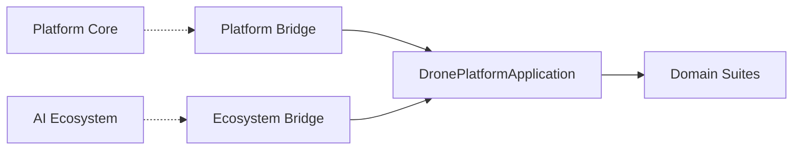

# Dependency Graph

- Platform Core v3 (external, not modified)
- AI Ecosystem v1.5 (bridge)
- Drone Platform modules depend inward on shared store + application facade

Links: [[drone/ARCHITECTURE_GRAPH]] [[drone/KNOWLEDGE_GRAPH]]
