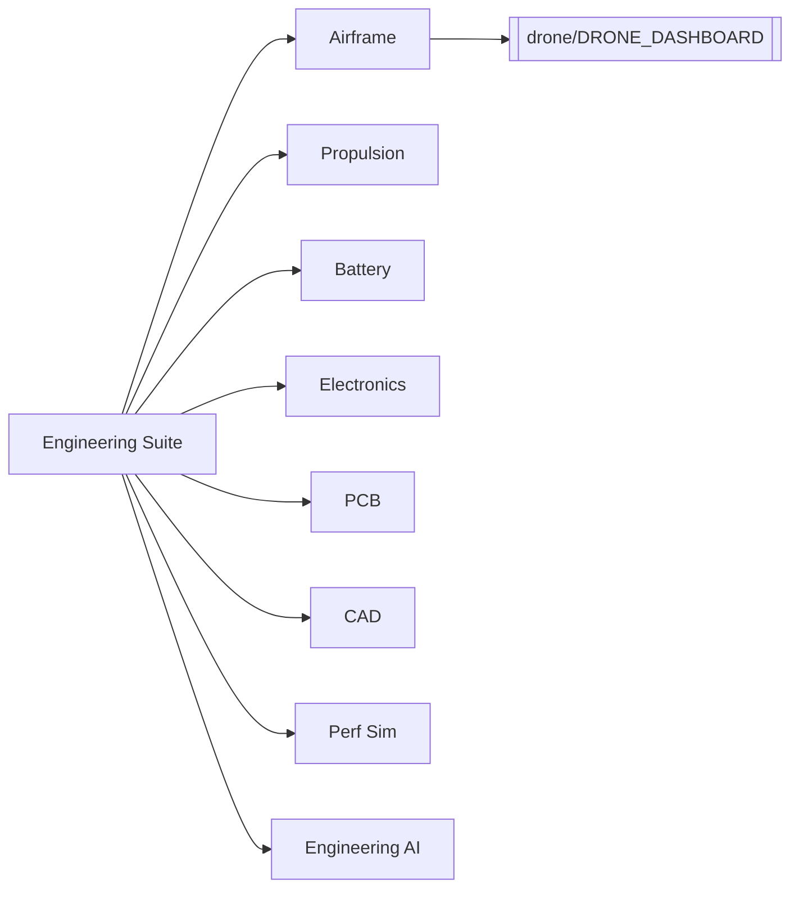
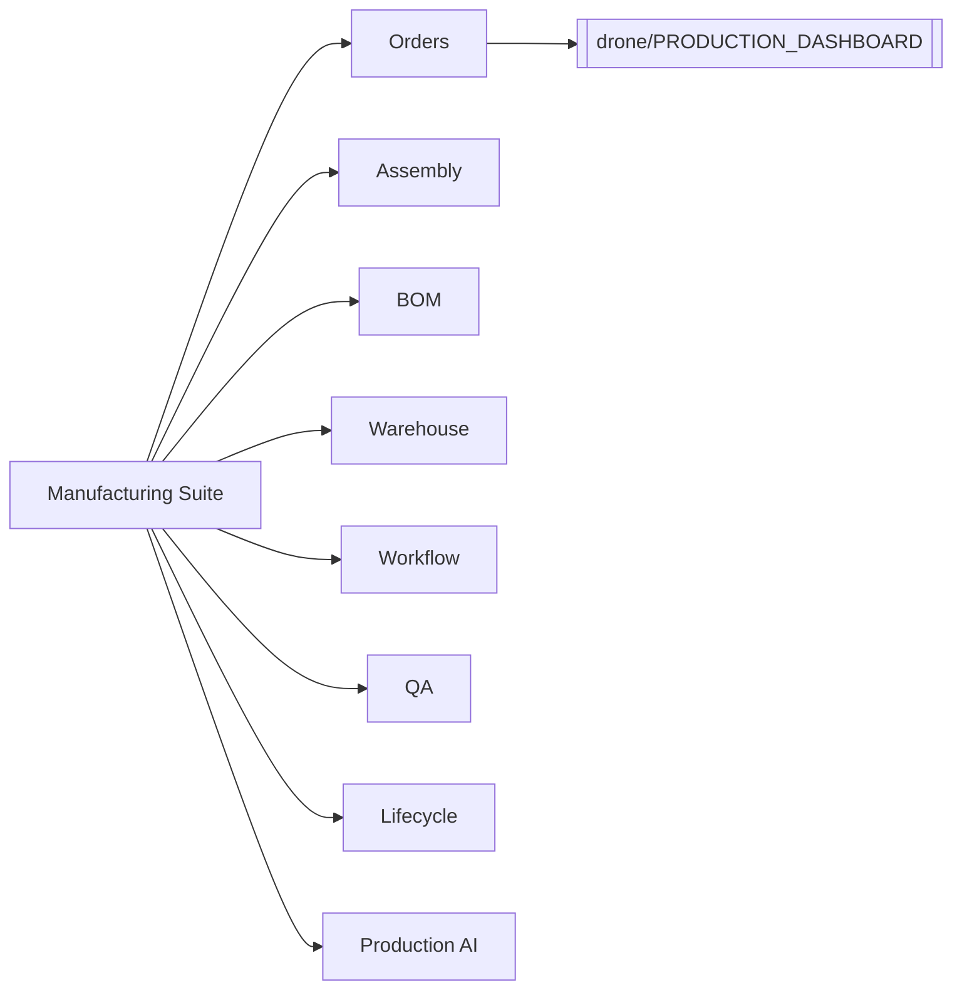

# Knowledge Graph

## Drone Engineering Suite (11.5)

## Manufacturing & Production (11.6)

Links: [[drone/ENGINEERING_REGISTRY]] · [[drone/MANUFACTURING_REGISTRY]] · [[drone/PRODUCTION_DASHBOARD]] · [[drone/DRONE_DASHBOARD]] · [[INDEX]]
