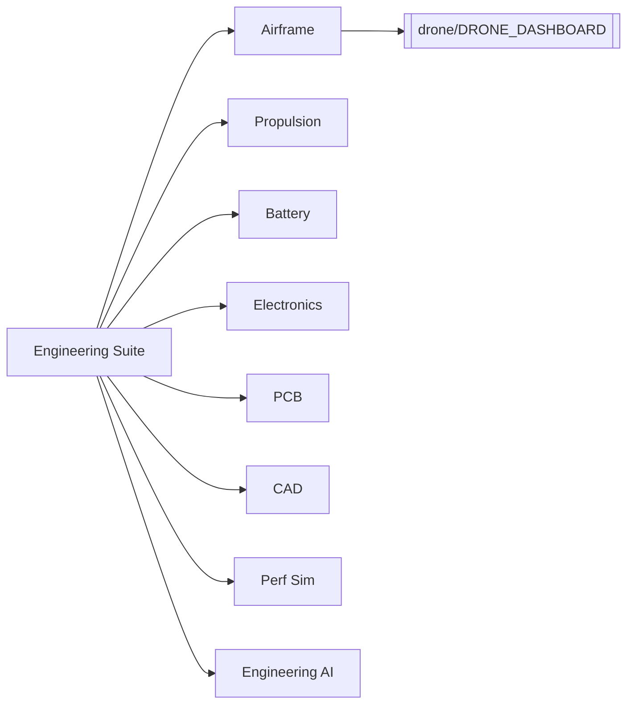
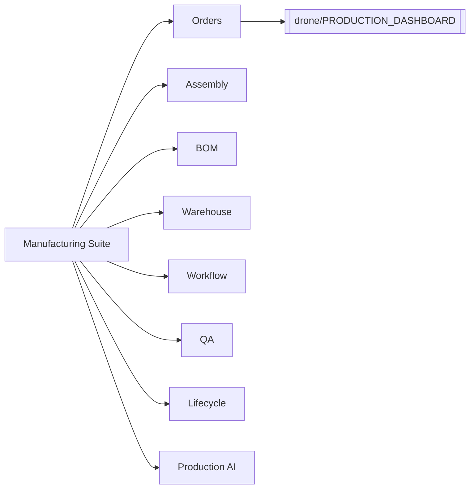
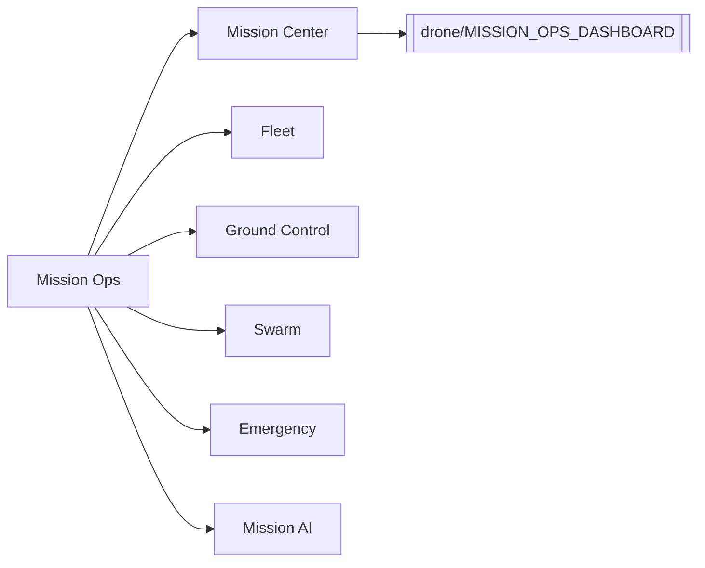
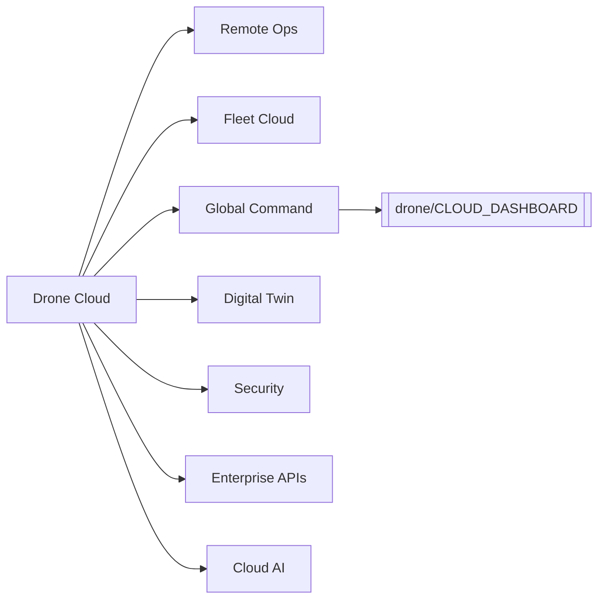
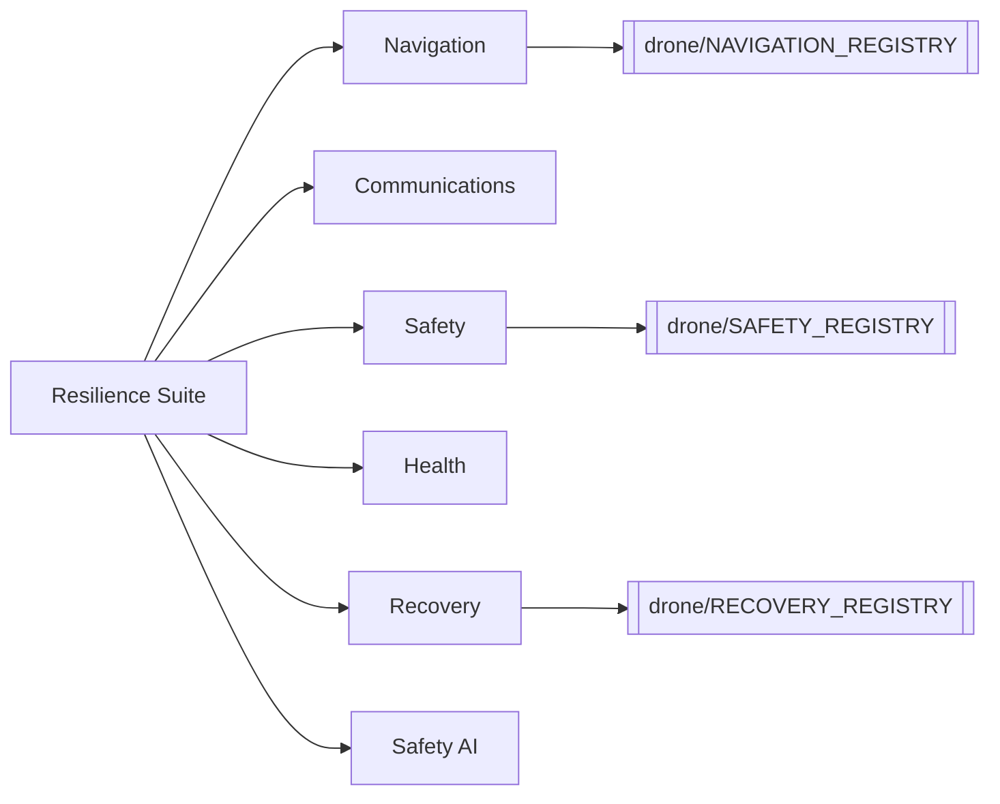
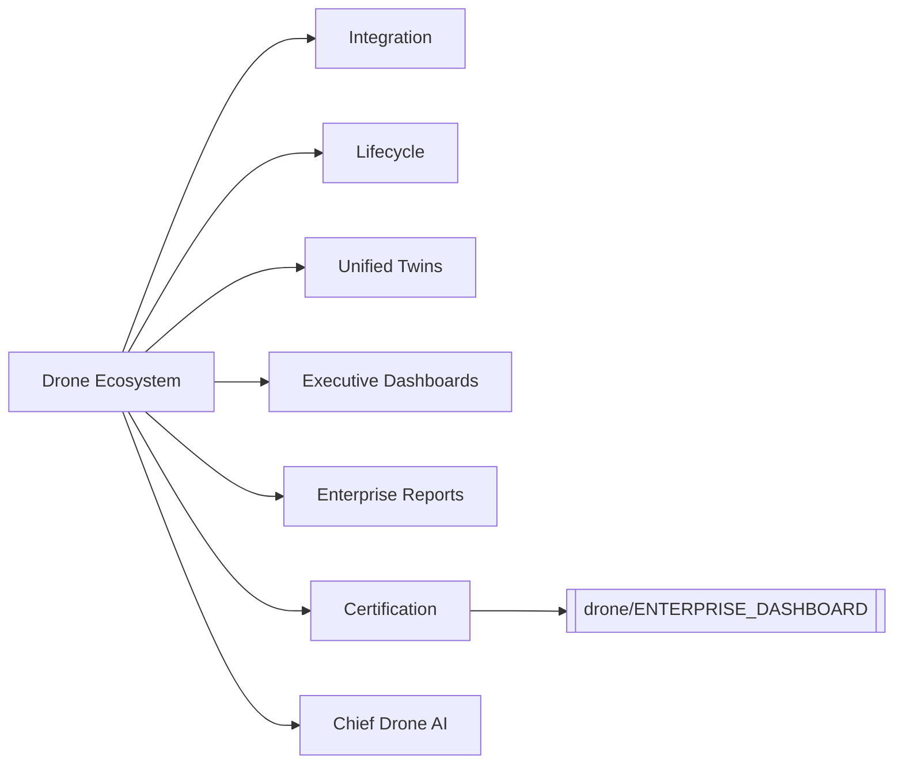

# Knowledge Graph

## Drone Engineering Suite (11.5)

## Manufacturing & Production (11.6)

## Mission Operations (11.7)

## Drone Cloud & Global Command (11.8)

## Resilient Navigation & Safety (11.9)

## Unified Ecosystem & Certification (11.10)

Links: [[drone/ENGINEERING_REGISTRY]] · [[drone/MANUFACTURING_REGISTRY]] · [[drone/MISSION_OPS_REGISTRY]] · [[drone/CLOUD_REGISTRY]] · [[drone/NAVIGATION_REGISTRY]] · [[drone/SAFETY_REGISTRY]] · [[drone/AI_REGISTRY]] · [[drone/DRONE_REGISTRY]] · [[drone/ENTERPRISE_DASHBOARD]] · [[drone/ARCHITECTURE_GRAPH]] · [[drone/DEPENDENCY_GRAPH]] · [[INDEX]]
